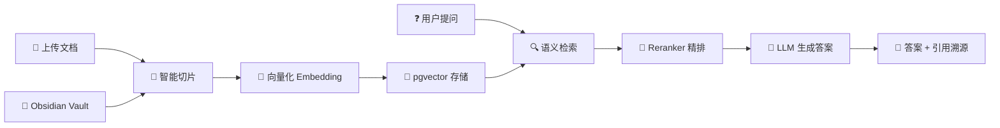

<p align="center">
  
</p>

<h1 align="center">mindvaults</h1>
<p align="center">开源、隐私至上的本地 RAG 知识库问答系统。你的数据，永远归你所有。</p>

<p align="center">
  <a href="#-部署"></a>
  
  
  
  
  
  
  
</p>

---

<p align="center">
  
</p>

## 这是什么

mindvaults 是一款 **RAG（检索增强生成）知识库问答系统**，支持本地私有化和云端 API 双模式部署。上传文档 → 自动解析切片向量化 → 自然语言提问 → 大模型结合文档生成带引用溯源的答案。


---

## 知识库
<p align="center">
  
</p>

## 推理过程
<p align="center">
  
</p>

## 引用溯源
<p align="center">
  
</p>


## 快速开始

```bash
# 1. 拉取代码
git clone https://github.com/sqking-coke/mindvaults.git && cd mindvaults

# 2. 创建配置文件（保留 .env 里已有的 API Key 预设）
cp .env.demo .env

# 3. 一键启动（5 个容器：Nginx + 前端 + 后端 + PostgreSQL + Redis）
docker compose --env-file .env up -d

# 4. 打开浏览器
# http://localhost → 进入系统设置 → 填入 API Key → 开始问答
```

| 部署模式 | 命令 | 说明 |
|------|------|------|
| 云端 API（推荐） | `docker compose --env-file .env up -d` | LLM / Embedding 走 DeepSeek、OpenAI 等 |
| 本地全栈 | `docker compose --profile full --env-file .env up -d` | 加 Ollama 容器，完全离线运行 |
| 演示体验 | `git checkout demo && docker compose --env-file .env.demo up -d` | 预置示例文档，禁止上传 |


## 核心特性

- **RAG 全链路透明**：意图识别 → 向量检索 → Reranker 精排 → LLM 生成，每一步通过 SSE progress 事件实时可见
- **引用溯源**：每个答案标注来源文档、原文片段和相似度评分，点击引用编号查看原文
- **双模式部署**：轻量模式（5 容器，走云端 API）或全栈模式（6 容器，Ollama 本地推理），从 Mac mini 到云服务器都能跑
- **多知识库隔离**：创建多个 KB，文档、切片、会话、配置独立管理，检索自动限定范围（或全局搜索）
- **多格式文档**：支持 PDF / Word / Markdown / TXT 上传，自动解析、切片、向量化
- **Obsidian Vault 导入**：笔记库一键导入，自动提取 YAML frontmatter 属性
- **可拔插模型架构**：LLM 和 Embedding 独立配置，DeepSeek / OpenAI / 硅基流动 / Ollama 自由组合

## 技术栈

| 层 | 技术 |
|------|------|
| 前端 | Next.js 14 (App Router) + TypeScript + TailwindCSS |
| 后端 | FastAPI + Uvicorn + SQLAlchemy 2.0 |
| 数据库 | PostgreSQL 16 + pgvector (HNSW 索引) |
| 缓存 | Redis 7 |
| LLM | DeepSeek / OpenAI / 通义千问 / Ollama 本地 |
| Embedding | 硅基流动 / OpenAI / Ollama (BGE-large-zh-v1.5) |
| 部署 | Docker Compose + Nginx |

## 本地开发

依赖 Python 3.12 + Node.js 22 + PostgreSQL 16 + Redis。

```bash
# 后端
cd backend && cp ../.env . && source venv/bin/activate
alembic upgrade head
uvicorn app.main:app --host 0.0.0.0 --port 8000 --reload

# 前端
npx next dev
```

访问 `http://localhost:3000`，API 文档 `http://localhost:8000/docs`。

## 文档

- [API 接口契约](docs/planning/03-API接口契约.md)
- [数据库设计](docs/planning/05-数据库设计.md)
- [系统架构设计](docs/planning/02-系统架构设计.md)
- [部署运维](docs/DEPLOYMENT_GUIDE.md)
- [全部文档索引](docs/planning/README.md)
